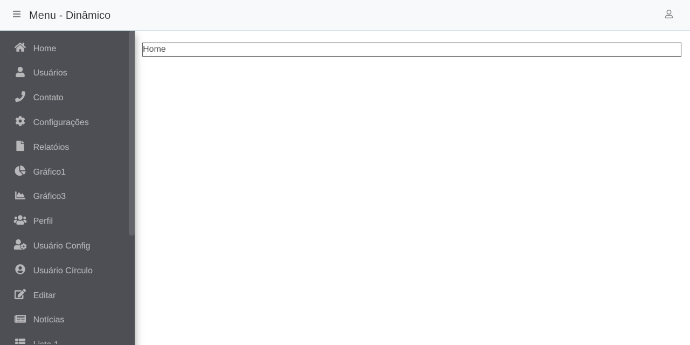

## Menu dinâmico

Permite salvar os menus de forma dinâmica em um banco de dados e acessá-los conforme a regra de negócio aplicada. 
 
[Clique aqui](https://menu-dinamico-aa2b8.web.app/) para ver uma demonstração da tela.
 

#### Crie um banco de dados
Digite suas informações de acesso, no arquivo [application.properties](https://github.com/TiagoC-Aguiar/menu-dinamico/blob/master/src/main/resources/application.properties), 
localizado em src/main/resources

Exemplo: (um banco de dados chamado menu_teste em MySQL)

`spring.datasource.url=jdbc:mysql://localhost:3306/menu_teste`

`spring.datasource.username=root`

`spring.datasource.password= `

#### Baixe e abra o projeto em uma IDE e o execute. (recomendado)

Ou abra o terminal, na pasta raiz do projeto, e digite o comando abaixo

`./mvnw spring-boot:run`

#### Acesse o front-end dentro do diretório [src/main/webapp](https://github.com/TiagoC-Aguiar/menu-dinamico/tree/master/src/main/webapp) para executá-lo

Digite o comando abaixo para atualizar as dependências e excutar o front-end

`yarn install`

`yarn start`

#### Abra o navegador e digite [http://localhost:3000](http://localhost:3000) na url para ver o projeto.
